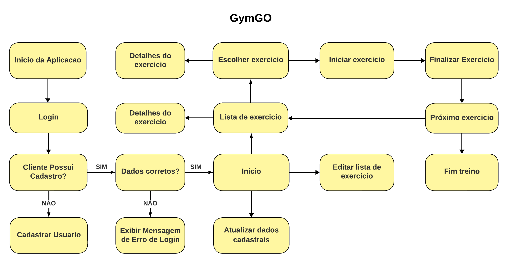

#Projeto de Interface

Pré-requisitos: <a href="2-Especificação do Projeto.md"> Documentação de Especificação</a>

 <a href="2-Especificação do Projeto.md"> Documentação de Especificação</a>.

## Diagrama de Fluxo

Este diagrama de fluxo representa o funcionamento básico de um aplicativo de academia, desde o login inicial até a conclusão de um treino. 

Este diagrama de fluxo fornece uma visão clara do processo envolvido no uso do aplicativo de academia GymGo, desde o login até a realização e registro de treinos, permitindo uma experiência de usuário intuitiva e eficiente.

## Wireframes

# Projeto Para Celular

      
   

 
   

 
   
   

 
   
   

 
   

 
   

